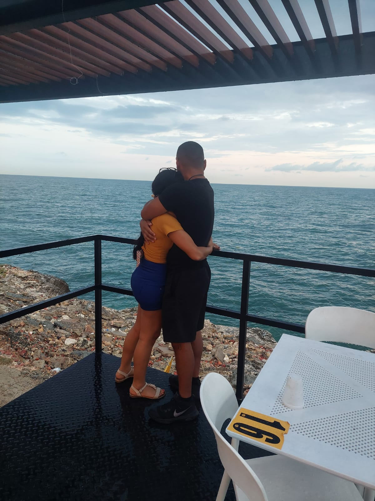

<HTML>
<head>
<audio controls loop>
<source SRC= center>
<source SRC ="cancion1.mp4"type="audio/mpeg">

<cancion.mp3"type=audio/mpeg">

</audio>

<litle>  ""

</litle>
</head>

 

</style>
<body>

Tu eres mi persona favorita

El hombre con el que me encanta compartir cada momento

<section>
Me encanta como siempre intentas ser mejor persona cada dia, me hace sentir que tengo al mejor esposo del mundo.  

 

 <width:20% ; margin:0px auto; border: 1px solid white>

<section> Me encanta .

 Y tambien me encanta cuando te pones un poco loco 

<section> Eres mi hombre sexy y tentador
 

 
<section>
 

<section>

 
<section> Yo adoro tu parte conquistadora y amo tambien cuando eres dulce y tierno 
 

<Section> "Me siento muy afortunada por haberte conocido, eres lo mas hermoso que me ha pasado, y siento que la vida me sonrie cada vez que te veo porque  todo es bello cuando estas a mi lado"
<Section> 
<Section img= "width: 0px ; Flex-grow: 1 ; object-fit: cover; opacity: 8; transicion: 5s ease" >
<Section img: hover "cursor: crosshair; widt: 300px ;opacity 1 ; filter: contrast (120%)">

</Section>
 
<BODY BGCOLOR= "black">
<footer>   Me encanta todo quien eres, tu honestidad, tu pasion, tu valentia para afrontar cualquier desafio, tu solidaridad y ese equilibrio entre fortaleza y dulzura,son irresistibles. Eres una parte fundamental la cual necesito, porque me complementas, eres mi amigo y confidente y amo cada minuto que seas parte de mis dias.

</footer>

</HTML>
